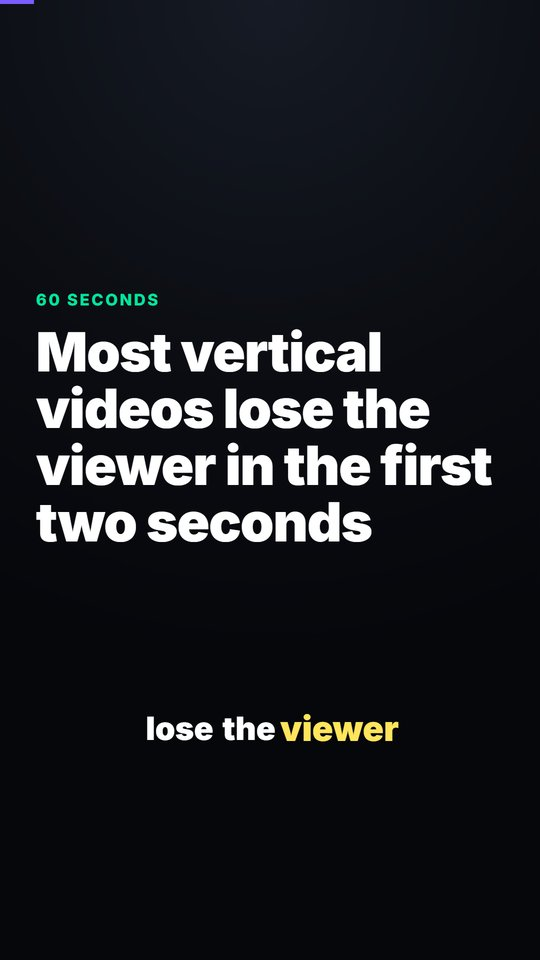
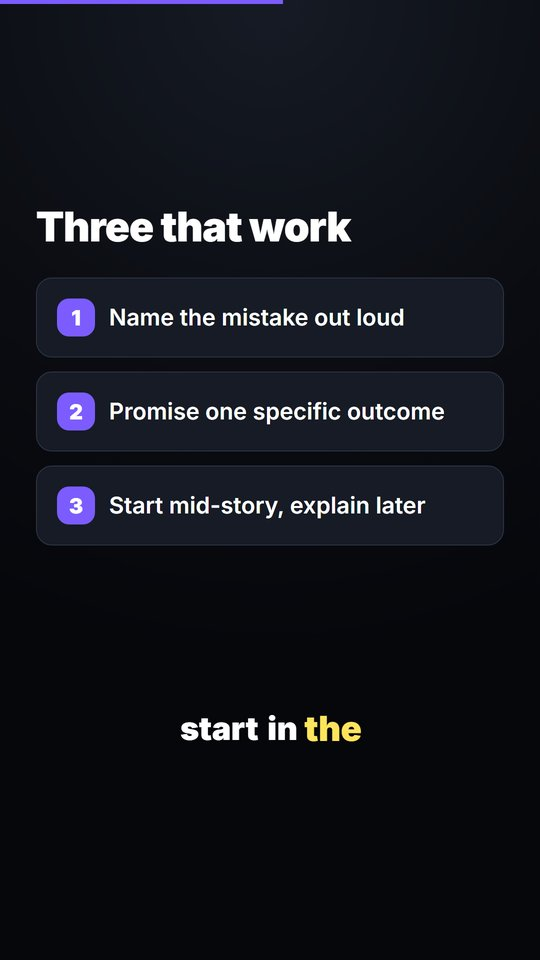
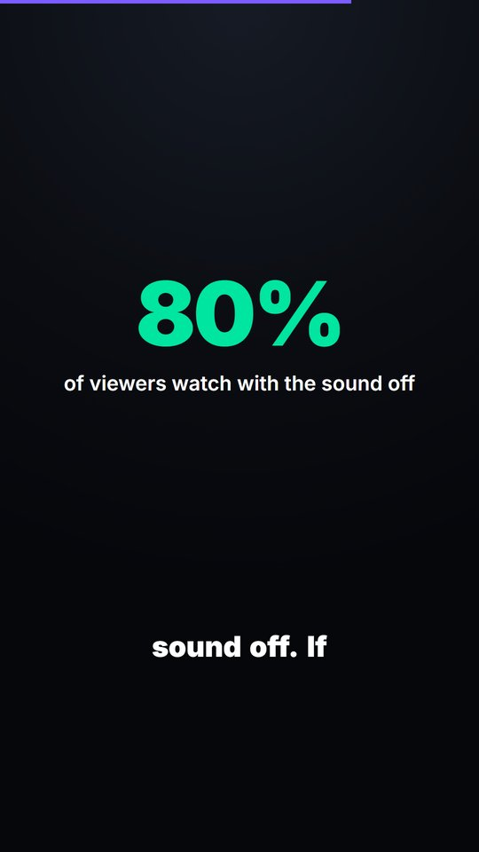

# vertical-video-kit

Haz TikToks, Reels y Shorts con código — locución que no suena a robot,
subtítulos palabra por palabra y un render real de 1080×1920.

<p align="center">
  
  
  
</p>

> **No necesitas pagar ninguna IA para usar esto.** El kit es Python y Node. Un
> agente de IA lo hace más rápido, pero todos los scripts funcionan solos desde
> la terminal, y hay un asistente que te hace cinco preguntas y te entrega un
> MP4 terminado. Ver **[¿Hay que pagar una IA?](#hay-que-pagar-una-ia)** o irte
> directo a [`docs/SIN-AGENTE.md`](docs/SIN-AGENTE.md).
>
> [English](README.md) · [Prompts listos para copiar](docs/PROMPTS.es.md)

## Por qué

Editar un video en una línea de tiempo hace que cada corrección sea rehacer
todo a mano. Por eso las correcciones no se hacen, y los videos salen con
errores que nadie quiso arreglar.

Aquí el contenido vive separado del diseño. Cambiar una frase de la locución
es editar una línea y volver a correr un script: la voz se regenera, la escena
cambia de duración sola, la animación se re-sincroniza y los subtítulos siguen.

Tres problemas que resuelve de verdad:

- **TTS que suena a TTS.** Casi siempre es el texto, no el motor. Cada línea
  se normaliza para el oído antes de llegar a la voz — siglas deletreadas,
  símbolos expandidos, puntuación que marca el ritmo — y puedes poner pausas
  reales con `[pause:0.4]`. Los motores por defecto son gratis.
- **Subtítulos puestos al final.** Se generan del audio que realmente se
  renderizó, así que el resaltado cae sobre la palabra que se está diciendo.
  El layout les reserva su franja desde el principio.
- **Texto debajo de la interfaz de la plataforma.** TikTok e Instagram tapan
  los ~380px de abajo y los ~160px de la derecha. La plantilla lo sabe, y
  puedes encender una capa para verlo.

## Instalación

**Un solo comando**, en un computador donde no hay nada:

```bash
git clone https://github.com/SDuarteCorredor/vertical-video-kit
cd vertical-video-kit
python install.py
```

Eso instala Node, FFmpeg y los paquetes de Python, crea tu primer proyecto y
**abre el visualizador de Remotion en el navegador** — la vista previa en vivo,
donde ves el video cambiar mientras lo editas. Si lo corres dos veces se salta
lo que ya está.

<p align="center">
  <code>python install.py</code> → dependencias → un proyecto → el visualizador
  abierto en <code>localhost:3000</code>
</p>

Si `python` no existe, prueba `python3` (macOS, Linux) o `py` (Windows). Si
Python no está instalado, `bash setup.sh` / `powershell -ExecutionPolicy Bypass
-File setup.ps1` lo instala primero.

Para volver a abrir el visualizador después:

```bash
python skills/vertical-video/scripts/studio.py mi-video
# o, dentro del proyecto:  npm run dev
```

> ¿No tienes `git`? En la página del repositorio en GitHub: botón verde
> **Code → Download ZIP**, y descomprímelo. Es lo mismo.

<details>
<summary><b>Instalarlo como skills de agente</b></summary>

**75+ agentes** vía [skills.sh](https://skills.sh):

```bash
npx skills add SDuarteCorredor/vertical-video-kit
```

**Claude Code** (requiere plan pago):

```
/plugin marketplace add SDuarteCorredor/vertical-video-kit
/plugin install vertical-video-kit
```

**Codex CLI, Cursor, opencode, Copilot, Windsurf** leen el
[`AGENTS.md`](AGENTS.md) de la raíz, que arranca con el comando de instalación
y le dice al agente que te deje mirando el visualizador. Clona primero y abre
el agente **adentro** de la carpeta, para que alcance a leer ese archivo:

```bash
git clone https://github.com/SDuarteCorredor/vertical-video-kit
cd vertical-video-kit
codex          # y ahí: "Instala esto y déjame el visualizador abierto."
```

En Linux un agente no puede escribir una contraseña de sudo, así que instala
Node y FFmpeg tú primero si faltan — está explicado en
[`docs/SIN-AGENTE.md`](docs/SIN-AGENTE.md#camino-c--con-codex-o-cualquier-agente).

**Gemini CLI** hay que apuntarlo. Crea `.gemini/settings.json`:

```json
{ "context": { "fileName": ["AGENTS.md", "GEMINI.md"] } }
```
</details>

## Para empezar

**El asistente** — cinco preguntas, sin IA, sin configurar nada:

```bash
python skills/vertical-video/scripts/wizard.py
```

**O a mano**, si `install.py` ya te creó el proyecto:

```bash
cd mi-video

# escribe script.json (lo que se dice) y src/content.ts (lo que se ve)

python scripts/voice.py        # locución + duración de cada escena
python scripts/captions.py     # subtítulos palabra por palabra
npm run dev                    # el visualizador, vista previa en vivo
npm run render                 # output/video.mp4
python scripts/publish.py      # upload/video.mp4, codificado para las plataformas
```

El visualizador se recarga solo cada vez que guardas, así que déjalo abierto
mientras escribes. Funciona también en un proyecto recién creado: cada escena
dura 3 segundos hasta que `voice.py` mide la locución real.

**O que una IA te escriba los textos** — [`docs/PROMPTS.es.md`](docs/PROMPTS.es.md)
tiene prompts para agentes y para cualquier chat gratuito, incluido un prompt
maestro que devuelve los dos archivos listos para pegar.

## ¿Hay que pagar una IA?

No. Un agente edita los archivos y corre los comandos por ti; es cómodo y es
completamente opcional.

| Herramienta | ¿Gratis? | Qué hace falta |
|---|---|---|
| **Sin IA** | sí | nada — el asistente, o los dos archivos a mano |
| **Cualquier chat web** (ChatGPT, Claude, Gemini, DeepSeek…) | sí | una cuenta gratis. Copiar y pegar de [`docs/PROMPTS.es.md`](docs/PROMPTS.es.md) |
| **[Codex CLI](https://github.com/openai/codex)** | **sí, con límites** | cuenta gratis de ChatGPT. `npm i -g @openai/codex` |
| **[Gemini CLI](https://github.com/google-gemini/gemini-cli)** | **sí** | cuenta de Google, ~1.000 peticiones al día |
| **GitHub Copilot** | plan gratuito limitado | cuenta de GitHub, dentro de VS Code |
| **Claude Code** | **no** | plan pago de Claude (Pro, ~US$20/mes) o créditos de API |

Codex CLI entra con una cuenta **gratuita** de ChatGPT: el plan gratis alcanza
para tareas de código cortas y locales, que es el tamaño de lo que hay que
hacer aquí. Claude Code es el que no es gratis — el plan gratuito de Claude no
lo incluye.

Paso a paso para un computador donde no hay nada instalado:
[`docs/SIN-AGENTE.md`](docs/SIN-AGENTE.md).

## Qué trae

| | |
|---|---|
| `skills/vertical-video` | Guion → voz → subtítulos → render. La principal. |
| `skills/clip-cutter` | Video horizontal largo → clips verticales con subtítulos quemados |
| `skills/reference-research` | Desarma un video que funciona y reutiliza su estructura |
| `template/remotion-vertical` | El proyecto Remotion 9:16 que copia `new_project.py` |
| `AGENTS.md` | Punto de entrada para Codex, Cursor, Gemini CLI, opencode, Copilot |
| `install.py` | El comando único: dependencias, un proyecto y el visualizador abierto |
| `docs/SIN-AGENTE.md` | Instalar y correrlo sin IA, en Windows, macOS o Linux |
| `docs/PROMPTS.es.md` | Prompts para agentes y para cualquier chat gratuito |

Los `SKILL.md` están escritos para que también los lea una persona. Las reglas
de diseño, los patrones de gancho, el oficio de la voz y lo específico de los
videos corporativos están en `skills/vertical-video/references/` (en inglés).

## Motores de voz

Se elige con `"engine"` en `script.json`. Intercambiables, misma interfaz.

| Motor | Costo | Calidad | Necesita |
|---|---|---|---|
| `edge` | gratis | decente, se nota sintética | `pip install edge-tts` — nada más |
| `voicestudio` | gratis | la mejor, y clona voces | [VoiceStudio](https://github.com/debpalash/VoiceStudio) corriendo local |
| `openai` | pago | muy natural | `OPENAI_API_KEY` |
| `elevenlabs` | pago | la mejor comercial | `ELEVENLABS_API_KEY` |

`edge` es el punto de partida sin instalar nada y sin cuenta. `voicestudio`
suena mejor y también es gratis, pero es una app de escritorio que hay que
dejar abierta — si no está corriendo, `voice.py` se pasa a `edge` y te avisa.

**Para español:** usa el acento del país de la audiencia. Un video para
Colombia narrado en español de España suena importado y distrae más de lo que
uno esperaría. `es-CO-SalomeNeural`, `es-MX-DaliaNeural`, `es-AR-ElenaNeural`.

## Requisitos

- **Node 18+** y **FFmpeg** — obligatorios
- **Python 3.9+** — para los scripts
- `pip install edge-tts faster-whisper yt-dlp` — voz, subtítulos, descargas

`python install.py` se encarga de todo.
`python skills/vertical-video/scripts/doctor.py` dice qué falta.

## Construido sobre

[Remotion](https://github.com/remotion-dev/remotion) para renderizar ·
[VoiceStudio](https://github.com/debpalash/VoiceStudio) para la voz local ·
[Whisper](https://github.com/openai/whisper) vía
[faster-whisper](https://github.com/SYSTRAN/faster-whisper) para subtítulos ·
[FFmpeg](https://ffmpeg.org) ·
[yt-dlp](https://github.com/yt-dlp/yt-dlp)

Remotion es gratis para personas y equipos pequeños, pero
[pide licencia de empresa](https://remotion.dev/license) por encima de ese
umbral. Lo demás es gratis.

## Úsalo con cabeza

Descarga solo lo que tengas derecho a usar. Clona solo tu propia voz, o una
para la que tengas permiso explícito. No pongas cifras, promesas ni
afirmaciones que nadie verificó — si el video lleva el nombre de una empresa,
lee [`references/corporate.md`](skills/vertical-video/references/corporate.md).

## Licencia

MIT. Ver [LICENSE](LICENSE).

[English](README.md)
