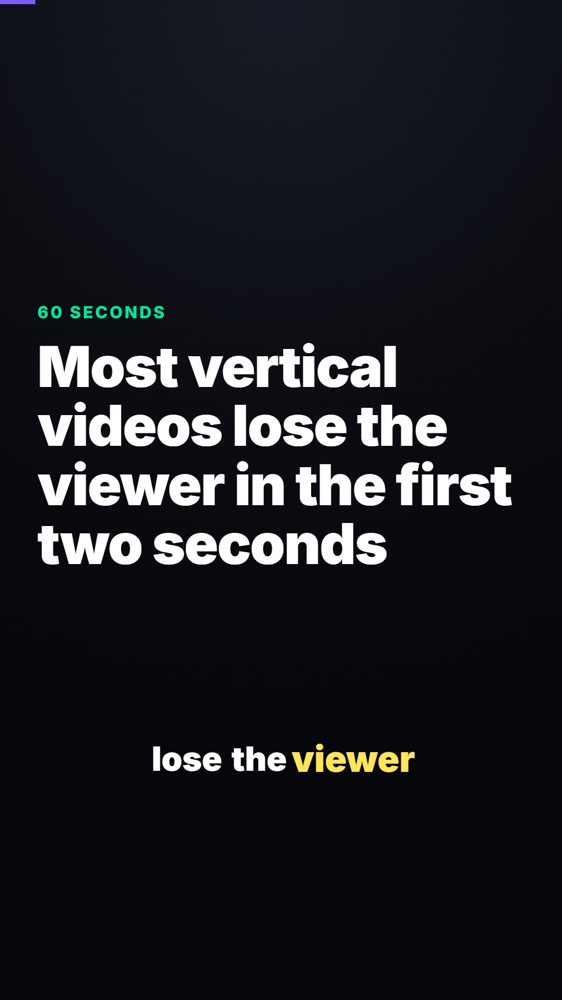
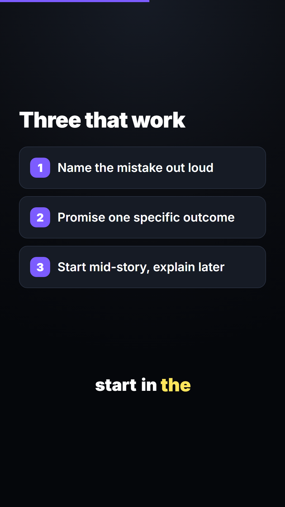
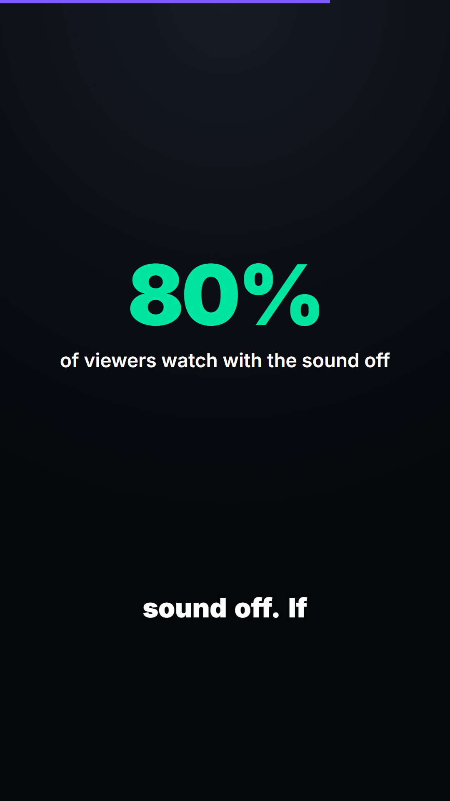

# vertical-video-kit

Make TikToks, Reels and Shorts in code — narration that doesn't sound like a
robot, word-by-word captions, and a real 1080×1920 render.

<p align="center">
  
  
  
</p>

> **You don't need an AI subscription to use this.** The kit is Python and
> Node. AI agents make it faster, but every script runs on its own from a
> terminal, and there's a wizard that asks you five questions and hands back a
> finished MP4. See **[Do you need to pay for an AI?](#do-you-need-to-pay-for-an-ai)**
> or jump straight to [`docs/NO-AGENT.md`](docs/NO-AGENT.md).
>
> [Español](README.es.md) · [Sin agente, sin pagar](docs/SIN-AGENTE.md)

## Why

Editing a short in a timeline means every correction is a manual redo. So
corrections don't happen, and videos ship with mistakes nobody was willing to
go back and fix.

Here the content lives apart from the design. Changing a line of narration is
editing one line and re-running a script — the voice regenerates, the scene
length changes to match, the animation re-syncs, and the captions follow.

Three problems this solves properly:

- **TTS that sounds like TTS.** Most of it is the text, not the engine. Every
  line is normalized for the ear before it reaches the voice — acronyms
  spelled out, symbols expanded, pacing punctuation — and you can place real
  pauses with `[pause:0.4]`. The default engine runs locally and free.
- **Captions as an afterthought.** They're generated from the audio that was
  actually rendered, so the highlight lands on the word being said. The layout
  reserves their band from the start.
- **Text under the platform UI.** TikTok and Reels cover the bottom ~380px and
  the right ~160px of your video. The template knows, and you can switch on an
  overlay to see it.

## Install

**One command**, on a machine with nothing on it:

```bash
git clone https://github.com/SDuarteCorredor/vertical-video-kit
cd vertical-video-kit
python install.py
```

That installs Node, FFmpeg and the Python packages, creates your first
project, and **opens the Remotion studio in your browser** — the live preview,
where you watch the video change as you edit it. Run it twice and it skips
whatever is already there.

<p align="center">
  <code>python install.py</code> → dependencies → a project → the studio open at
  <code>localhost:3000</code>
</p>

If `python` isn't found, try `python3` (macOS, Linux) or `py` (Windows). If
Python isn't installed at all, `bash setup.sh` / `powershell -ExecutionPolicy
Bypass -File setup.ps1` bootstraps it first.

To open the studio again later:

```bash
python skills/vertical-video/scripts/studio.py my-video
# or, inside the project:  npm run dev
```

<details>
<summary><b>Installing it as agent skills instead</b></summary>

**75+ agents** via [skills.sh](https://skills.sh):

```bash
npx skills add SDuarteCorredor/vertical-video-kit
```

**Claude Code** (paid plan required):

```
/plugin marketplace add SDuarteCorredor/vertical-video-kit
/plugin install vertical-video-kit
```

**Codex CLI, Cursor, opencode, Copilot, Windsurf** read the
[`AGENTS.md`](AGENTS.md) at the repo root. Point one at this repository's URL
and say "install this" — `AGENTS.md` opens with the install command and tells
it to leave you looking at the studio.

**Gemini CLI** needs to be pointed at it. Create `.gemini/settings.json`:

```json
{ "context": { "fileName": ["AGENTS.md", "GEMINI.md"] } }
```
</details>

## Quick start

**The wizard** — five questions, no AI, no config:

```bash
python skills/vertical-video/scripts/wizard.py
```

**Or by hand**, if `install.py` already made you a project:

```bash
cd my-video

# write script.json (what is said) and src/content.ts (what is seen)

python scripts/voice.py        # narration + scene timings
python scripts/captions.py     # word-by-word captions
npm run dev                    # the studio, live preview
npm run render                 # output/video.mp4
python scripts/publish.py      # upload/video.mp4, encoded for the platforms
```

The studio reloads on every save, so leave it open while you write. It works
on a brand-new project too — scenes hold 3 seconds each until `voice.py` has
measured the real narration.

**Or ask an AI to write the text for you** — [`docs/PROMPTS.md`](docs/PROMPTS.md)
has prompts for coding agents and for any free chat, including a master prompt
that returns both files ready to paste.

## Do you need to pay for an AI?

No. An agent edits the files and runs the commands for you, which is
convenient and entirely optional.

| Tool | Free? | What it needs |
|---|---|---|
| **No AI at all** | yes | nothing — the wizard, or the two files by hand |
| **Any web chat** (ChatGPT, Claude, Gemini, DeepSeek…) | yes | a free account. Copy-paste from [`docs/PROMPTS.md`](docs/PROMPTS.md) |
| **[Codex CLI](https://github.com/openai/codex)** | **yes, with limits** | a free ChatGPT account. `npm i -g @openai/codex` |
| **[Gemini CLI](https://github.com/google-gemini/gemini-cli)** | **yes** | a Google account, ~1,000 requests/day |
| **GitHub Copilot** | limited free tier | a GitHub account, in VS Code |
| **Claude Code** | **no** | a paid Claude plan (Pro, ~US$20/mo) or API credits |

Codex CLI signs in with a **free** ChatGPT account — the free tier covers short
local coding tasks, which is the size of the work here. Claude Code is the one
that isn't free: the free Claude plan doesn't include it.

Full walkthrough for a machine with none of this installed:
[`docs/NO-AGENT.md`](docs/NO-AGENT.md) · [`docs/SIN-AGENTE.md`](docs/SIN-AGENTE.md).

## What's inside

| | |
|---|---|
| `skills/vertical-video` | Script → voice → captions → render. The main one. |
| `skills/clip-cutter` | A long horizontal video → vertical clips with burned captions |
| `skills/reference-research` | Take apart a short that works and reuse its structure |
| `template/remotion-vertical` | The 9:16 Remotion project, scaffolded by `new_project.py` |
| `AGENTS.md` | Entry point for Codex, Cursor, Gemini CLI, opencode, Copilot |
| `install.py` | The one install command: dependencies, a project, the studio open |
| `docs/NO-AGENT.md` | Install and run with no AI, on Windows, macOS or Linux |
| `docs/PROMPTS.md` | Prompts for agents, and for any free chat |

Each skill's `SKILL.md` is written to be read by a human too — the design
rules, hook patterns, voice craft and corporate-video constraints are in
`skills/vertical-video/references/`.

## Voice engines

Set `"engine"` in `script.json`. Swappable, same interface.

| Engine | Cost | Quality | Needs |
|---|---|---|---|
| `edge` | free | decent, audibly synthetic | `pip install edge-tts` — nothing else |
| `voicestudio` | free | highest, clones voices | [VoiceStudio](https://github.com/debpalash/VoiceStudio) running locally |
| `openai` | paid | very natural | `OPENAI_API_KEY` |
| `elevenlabs` | paid | best commercial | `ELEVENLABS_API_KEY` |

`edge` is the zero-install starting point and needs no account. `voicestudio`
sounds better and is also free, but it's a desktop app you have to keep open —
if it isn't running, `voice.py` falls back to `edge` and says so.

Nothing leaves the machine on either free engine.

## Requirements

- **Node 18+** and **FFmpeg** — required
- **Python 3.9+** — for the scripts
- `pip install edge-tts faster-whisper yt-dlp` — voice, captions, downloads

`python install.py` handles all of it.
`python skills/vertical-video/scripts/doctor.py` reports what's missing.

## Built on

[Remotion](https://github.com/remotion-dev/remotion) for rendering ·
[VoiceStudio](https://github.com/debpalash/VoiceStudio) for local voice ·
[Whisper](https://github.com/openai/whisper) via
[faster-whisper](https://github.com/SYSTRAN/faster-whisper) for captions ·
[FFmpeg](https://ffmpeg.org) ·
[yt-dlp](https://github.com/yt-dlp/yt-dlp)

Remotion is free for individuals and small teams but
[requires a company license](https://remotion.dev/license) above that
threshold. The rest is free.

## Use it responsibly

Download only what you have the right to use. Clone only your own voice, or
one you have explicit permission to clone. Don't put claims, numbers or
promises in a video that nobody verified — see
[`references/corporate.md`](skills/vertical-video/references/corporate.md) if
the video carries a company's name.

## License

MIT. See [LICENSE](LICENSE).

[Español](README.es.md)
